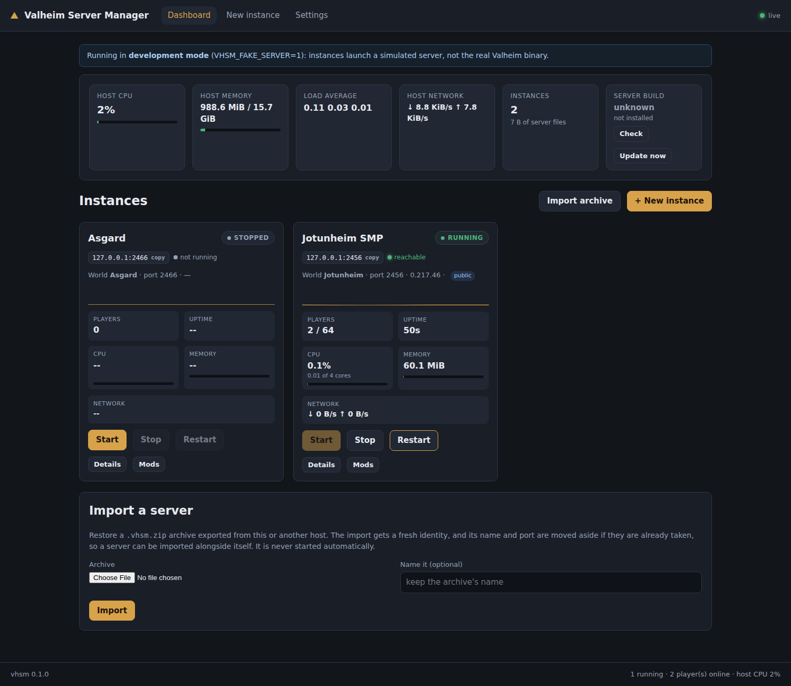

# Valheim Server Manager (vhsm)

A web GUI for running several Valheim dedicated servers on one host: create and
configure instances, start and stop them, watch live resource usage and player
counts, and manage mods per instance the way r2modman does on the desktop.

This is a first working version — the core of each area is implemented and
tested end to end, and the structure is meant to be built on.



## What works today

**Instances**
- Create, edit and delete instances from the GUI; each lives in its own
  directory and is described by an `instance.json`, so it can be copied,
  backed up or restored by moving a folder.
- Full launch configuration: name, world, password, port, public/crossplay,
  world preset and the five world modifiers, autosave and backup intervals,
  and free-form extra arguments.
- Validation mirrors what the server itself enforces (password length, the
  password not appearing in the server or world name, public servers needing a
  password) plus port-range collision checks between instances.

**Lifecycle**
- Start/stop/restart. Each server runs in its own process session, and stopping
  sends `SIGINT` first — Valheim's graceful shutdown, which saves the world —
  escalating to `SIGTERM` then `SIGKILL` only if it does not comply.
- Lifecycle actions run as manager-owned background tasks, so a browser that
  navigates away (or a button that re-renders mid-request) cannot abandon a
  restart half-finished. The UI shows `starting` / `stopping` / `restarting`
  while the work is in flight.
- Console output is streamed to the browser over a websocket and mirrored to
  `logs/console.log`.
- `autostart` boots flagged instances with the manager.

**Monitoring**
- Per-instance CPU, RSS, memory share, thread count and disk I/O via `psutil`,
  rolled up over the process tree. CPU is shown as a share of the whole host
  with the core count alongside: psutil's raw figure is summed across cores, so
  a server using three cores reports 300%, which reads as a broken gauge.
- The running server's version, taken from its console banner and confirmed
  against the Steam query response, on every card.
- Live player count from the Steam A2S query socket (`game port + 1`), with
  player *names* and platform ids parsed from the console log, since A2S does
  not report them reliably for Valheim. Each connected player shows their id,
  platform, playtime and admin/ban/permit flags.
- Per-instance network throughput via nftables counters on each instance's UDP
  port range. Linux has no per-process byte counters, so this is the honest way
  to get it; it needs root. Without it the UI says so and still shows host-wide
  traffic rather than pretending.
- Host CPU, memory, load average and network in the dashboard header.
- A **client visibility** probe on each instance that queries the server the way
  a Valheim client does and reports the UDP sockets the process actually holds,
  so "shows as unreachable in the client" can be told apart from "the game port
  is fine".

**Players and moderation**
- A roster of everyone who has ever joined, kept across restarts. Valheim's
  console is the only source of player identity a stock server offers and it
  says nothing about anyone not currently connected, so moderating someone who
  left an hour ago means having written down that they were here.
- Per player: names used, platform id, session count, time played, last seen
  ("now" while online, otherwise a timestamp) and a bounded log of their
  connects, spawns, deaths and disconnects — downloadable as a text file.
- Admin, ban, permit and kick from the roster, whether or not the player is
  online. Valheim re-reads its list files while running, so changes take effect
  within seconds without a restart.
- Kick is a brief ban that lifts itself, because a stock server exposes no RCON
  and ignores stdin. The pending expiry is written to disk, so a manager restart
  mid-kick still clears it rather than stranding the player on the banned list.
- The permitted list has an on/off switch. Valheim treats a non-empty
  `permittedlist.txt` as a whitelist, so switching it off parks the file rather
  than deleting it — the list survives to be switched back on.

**Worlds, backups and portability**
- Both save formats are handled. Since Valheim 1.0 a world is a **folder**
  named after it, holding `_main.<N>.db2`, `_main.<N>.fwl2`, `_main.<N>.chunks`,
  an `_main.<N>.ok` marker and many `.chunk` files, with several save
  generations side by side; older worlds are still a `.db` + `.fwl` pair.
  Worlds are always copied whole — a partial copy of a 1.0 world is not a
  smaller world, it is a broken one.
- Upload an existing world as a zipped folder or by picking the folder itself,
  and the instance is repointed at it. The server only loads the world its
  configuration names, so without that it would ignore the upload and generate
  an empty world instead.
- Snapshots taken on demand or on a per-instance schedule, kept in `backups/`
  inside the instance rather than in `worlds_local`, where a backup folder would
  show up as another world. Automatic snapshots are pruned to a configured
  count; ones taken by hand are never pruned. Valheim's own rotating backups are
  listed alongside them.
- Rollback to any restore point. The live world is snapshotted first, so a
  rollback can itself be undone, and it is refused while the server is running:
  a running server holds the world in memory and would overwrite the restored
  copy at its next autosave.
- Export a whole instance as one `.vhsm.zip` — configuration, world, access
  lists and the exact mod versions — and import it here or on another host.
  An import gets a fresh identity, and its name and port move aside if taken,
  so a server can be imported alongside itself. It never autostarts.

**Updates**
- The installed build id (from steamcmd's app manifest) is compared against the
  newest published build, so the dashboard can say whether an update exists
  rather than guessing from file dates, with an update button beside it.
- One-click update that stops running instances, updates, and starts them again
  — including when the update fails, since that is a bad reason to leave servers
  down.
- Optional daily scheduled update at a chosen time, with the same stop/start
  handling.
- The full steamcmd transcript is written to `steamcmd.log` and downloadable,
  so a failed install can still be read after its output has scrolled away.

**Addressing**
- A global server address (hostname or IP) that players connect to, shown as
  `host:port` beside every instance with a copy button.
- Each instance is probed at that address on a timer and reports whether it
  answered. The probe leaves the host, so it tests the path players take —
  though a router that will not loop traffic back to itself can report a working
  server as unreachable, and the UI says so.

**Interface**
- The instance page's sections (world and backups, players, configuration,
  danger zone) collapse, start collapsed, and remember what you opened.

**Mods (r2modman-style)**
- Browse and search the full Thunderstore catalogue for Valheim, cached to disk
  so searching is instant and works offline.
- Install with recursive dependency resolution; BepInEx is pulled in
  automatically because a Valheim mod cannot load without it.
- A shared package cache (`cache/<namespace-name>/<version>/`) means a package
  is downloaded once and installed into any number of instances from disk.
- r2modman's install rules: `plugins/`, `patchers/`, `monomod/`, `core/` and
  `config/` are routed to the right place, and anything else lands in
  `BepInEx/plugins/<Author>-<Mod>/` so uninstalling is exact.
- Enable/disable without deleting (files are renamed `.old`, as r2modman does).
- Config files are never renamed on disable or deleted on uninstall, and never
  overwritten on update — tuned settings survive.
- Update detection with one-click update-all, orphaned-dependency pruning,
  profile export/import, and manual `.zip` upload for packages not on
  Thunderstore.

## Requirements

- Linux, Python 3.11+
- `nftables` and root **only** for per-instance network graphs; everything else
  works unprivileged
- ~2 GB disk for the shared dedicated-server install

## Quick start

```bash
python3 -m venv .venv
.venv/bin/pip install -r requirements.txt

# Development: simulated servers, no Steam download needed
VHSM_FAKE_SERVER=1 .venv/bin/python run.py

# Production
.venv/bin/python run.py
```

Then open <http://127.0.0.1:8080>, go to **Settings** and install the dedicated
server (this runs `steamcmd +app_update 896660`), then create an instance.

`VHSM_FAKE_SERVER=1` swaps the real binary for `tools/fake_valheim_server.py`,
which emits Valheim-shaped console output, answers A2S queries and simulates
players joining and leaving. It makes the whole GUI exercisable — and the test
suite runnable — without downloading the game.

## Configuration

| Variable | Default | Meaning |
|---|---|---|
| `VHSM_DATA_ROOT` | `./data` | Everything the manager owns |
| `VHSM_HOST` | `127.0.0.1` | Bind address |
| `VHSM_PORT` | `8080` | Bind port |
| `VHSM_SAMPLE_INTERVAL` | `2.0` | Seconds between metric samples |
| `VHSM_INDEX_TTL` | `3600` | Thunderstore catalogue cache lifetime |
| `VHSM_FAKE_SERVER` | unset | Use the simulated server |

CLI flags `--host`, `--port`, `--data-root`, `--fake-server` and `--reload`
override these.

### Data layout

```
data/
  steam/                  steamcmd
  valheim/                shared dedicated-server install (app 896660)
  cache/                  Thunderstore packages + catalogue, shared
  instances/<id>/
    instance.json         configuration
    mods.json             installed mods, versions, owned files
    saves/                worlds and backups
    logs/console.log
    BepInEx/              this instance's mod profile
```

One shared game install keeps updates to a single download no matter how many
servers you run; instances differ only by their own directory. Mods are loaded
by pointing Unity Doorstop at the instance's own `BepInEx` tree with absolute
paths, so a modded and an unmodded instance differ only by what is on disk.

## Tests

```bash
.venv/bin/pip install -r requirements-dev.txt   # pyflakes, for the static gate
.venv/bin/python tests/smoke_test.py
```

166 checks covering page rendering, instance creation and validation, the
start/stop/restart lifecycle, the live-metrics and console websockets, CPU
normalisation, version reporting, player detail, every moderation path, query
socket discovery (including a socket bound to a single interface), the
connectivity probe, instance export/import (including rejection of a
traversing archive), world upload in both save formats (zipped folder, loose
files, and rejection of a traversing filename), snapshots and rollback of a 1.0
folder world and its undo, automatic snapshots and their pruning, the update
endpoints (including that a failed update still restarts the servers), the
player roster and its history export, the whitelist on/off switch, the server
address and reachability probe, and the whole mod flow (search, dependency resolution, disable/enable, config
preservation, dependency-protected uninstall, export). Runs against the
simulated server, so it needs no network and no Steam download.

The suite opens with a pyflakes pass over the whole tree, because compiling a
module only proves it parses: a name referenced inside a rarely-taken branch
stays invisible until that branch runs. The suite also creates the shared game
directory up front, so the code paths that only execute when a real install is
present are covered rather than skipped.

## Security

**There is no authentication yet.** The GUI can start processes and write files
on the host, so it binds to `127.0.0.1` by default. If you expose it, put it
behind a reverse proxy that authenticates, or reach it over an SSH tunnel.
Binding to anything else logs a warning and shows one in Settings. Server
passwords are stored in plain text in `instance.json` and rendered into the
edit form, as the server needs them on its command line.

## Known gaps / next steps

- No authentication or multi-user roles.
- **Ping is not shown, because Valheim does not expose it.** There is no RCON,
  the console never logs latency, and `A2S_PLAYERS` carries only a connection
  duration (which is shown). A per-player ping would have to be invented, so
  the field is reported as `null` rather than filled with a guess.
- No RCON-style console input — commands would need a server-side mod.
- No scheduled *restarts* (scheduled updates exist) and no crash auto-restart.
- Backups are Valheim's own; the manager does not run its own backup schedule
  beyond the snapshot it takes before a rollback.
- Mod install runs inline in the request; large packages block that request.
  Moving it to a background job with progress in the UI is the natural next step.
- `.r2x` files exported by r2modman itself are not yet parsed (our own JSON
  export/import is); the importer already understands its `{major, minor, patch}`
  version shape.
- Per-instance network needs root. A rootless fallback would need eBPF.

### Bringing an existing world in

From another dedicated server, or from single-player:

1. Find the world. Since Valheim 1.0 it is a **folder** named after the world
   inside `worlds_local` — on Linux that is
   `~/.config/unity3d/IronGate/Valheim/worlds_local/<World>/` when the old
   server ran without `-savedir`, otherwise under the `-savedir` it was given.
2. Zip that folder (the folder itself, not just its contents).
3. On the instance page, stop the server, then **Upload an existing world** →
   *A zipped world folder*. Picking the folder directly works too, in browsers
   that support directory selection.

The instance is repointed at whatever you upload, so the old trap of the
configured world name not matching the folder on disk — which makes Valheim
silently generate a fresh empty world — does not apply. Upload the whole
folder: one complete `_main.<N>` generation and its `.ok` marker must be
present, and the panel says so if they are not.

Copying files in by hand still works. Put the world folder in
`<data_root>/instances/<id>/saves/worlds_local/` and set the instance's world
name to match the folder exactly — it is case-sensitive. Access lists go in
`<data_root>/instances/<id>/saves/` as `adminlist.txt`, `bannedlist.txt` and
`permittedlist.txt`.

### If a server shows as unreachable in the client

A server's listing — its name, player count and version — comes from the
**Steam query socket**, not the game port, so a server can accept direct joins
while its entry looks dead.

Earlier versions of this manager probed `127.0.0.1` at `game port + 1` and
called the port closed when nothing answered. Both halves of that were
assumptions, and either being wrong looks identical from outside:

- the query socket is not guaranteed to sit at `game port + 1`;
- a socket bound to **one interface** is unreachable over loopback, so a
  perfectly healthy server reports "port not open".

The manager owns the server process, so it now asks the kernel which UDP
sockets that pid holds and probes the address each one is actually bound to,
instead of guessing. The same discovery feeds the live player count, so a
server that binds to a single interface is no longer invisible to it.

**Test client visibility** on the instance page shows the sockets the process
holds, every address tried, and which one answered. From there:

- Only the game port open, nothing else → the server never created a query
  socket. That points at Steam's game-server API failing to initialise rather
  than at a firewall.
- A socket answered on a port that is not `game port + 1` → forward that port.
- Everything answers locally but the client still cannot see it → UDP `port`
  through `port+2` need forwarding; the listing uses the query port.
- Crossplay servers are joined by their join code rather than through the Steam
  list, so the Steam entry can look wrong regardless of configuration.
